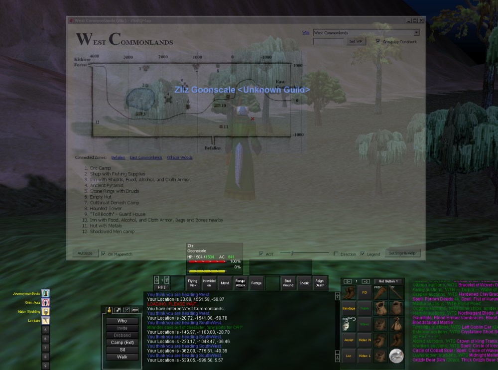

# ZLizEqMap

ZlizEQMap is a map tool mainly designed for servers that emulate old versions of EverQuest. It features a local database of maps from the old EQAtlas website (now hosted on allakabor.com and tessmage.com), along with player positioning (x plotted on map), transparent overlay, waypoints, zone connections, and more.

Original developer - Zliz http://www.zlizeq.com/ZlizEQ_Projects-ZlizEQMap

Adapted for TKAP by Baler

Updates and currently maintained by Cadsuane


## Build

Clone a build in IDE of your choice. 
If you run into build errors, removing the project from the solution and re-adding solved my issues.


## Features

- Complete EQAtlas map library for the old world, The Planes, Kunark, Velious and selected other zones (some maps slightly improved and edited)
- Player location on the map, marked with an 'x' when you perform a /loc in-game
- In addition to marking the player location, can show direction arrow (based on Sense Heading)
- Automatic zone switching as you zone in-game
- EQAtlas map legend (some slightly edited)
- Automatic detection of which character you're playing
- Multiple maps per zone, for example in dungeons with multiple floors
- List of clickable connected zones for each zone
- Waypoint functionality
- Adjustable transparency and always-on-top
- Server-agnostic; supports Project1999, The Al'Kabor Project, and can be extended to match any server
- Classic eqatlas.com look

## Screenshots


General map view; player location marked by red arrow.


Displaying map overlay feature; adjustable window transparency.

## Requirements

Microsoft Windows
.NET Framework 4.0
Tested on Windows 7 64-bit.

## Installation and Running

Extract the contents of the .zip file to any directory you like
Run ZlizEQMap.exe
Running it for the first time, a form will pop up where you must input the path to your EverQuest directory. Second, choose a zone dataset that matches the server you want to play on. You must also choose whether the log files for your EQ install are found in the \Logs subdirectory or in the root EQ directory. For somewhat modern clients such as Titanium, often used by Project1999, choose the "\Logs directory" option. For The Al'Kabor Project (EQMac client), choose the "Root directory" option.

All of the options can be changed later.

Furthermore, you can click a button to enable logging permanently in EQ.

Click OK, and the map window will open, by default in East Commonlands.


## Usage
First, you must enable logging in EverQuest, if you haven't done it already upon the first run of the program. Open your EQ directory in a file explorer and find the file named "eqclient.ini". Open it in your favorite text editor, and look for a line starting with "Log=". If it says "Log=TRUE", logging is enabled. If it says "Log=FALSE", simply change it to "Log=TRUE". Save the file and exit your text editor. EQ will now automatically log everything you see in your chat window(s) to text files named after your character and server, for example "eqlog_Zliz_project1999.txt".

If the program hasn't switched zones already for you (it won't detect it on the very first load, and not always if you start it up after having started EQ - a design/performance compromise), choose the zone you're in in the combobox in the top right corner.

As soon as the slightest thing is added to your log file (anything in your chat windows for example), the program will pick it up and display the name of the active character in the program's title bar at the top.

Now type /loc in-game and your position will be updated within a second with a red 'x' on the map. It's a good idea to make a macro (social) with /loc in it, bound to an easily accessible hotkey.

You can furthermore make it show the direction you're facing. This is dependent on performing a successful Sense Heading within 1 second before you do the /loc. If your Sense Heading fails or is on cooldown, the normal 'x' will be shown. In order to best make this work, make a macro like this:
```
/doability 1
/loc
```
...where the "1" after /doability points to the position your Sense Heading skill is in on the 2x3 "Abilities" grid.
If you run "off the map" and perform a /loc, a red circle will be shown instead of an 'x' where your location was last plotted. You will see this if you run down the East Commonlands tunnel towards Northern Desert of Ro, as the map only contains the mouth of the tunnel where traders hang out. Another zone where this is prominent is Eastern Plains of Karana, where the very long gorge leading towards Highpass Hold is not drawn on the map.

More information can be found at [ZLiz's website here.](http://www.zlizeq.com/ZlizEQ_Projects-ZlizEQMap)
